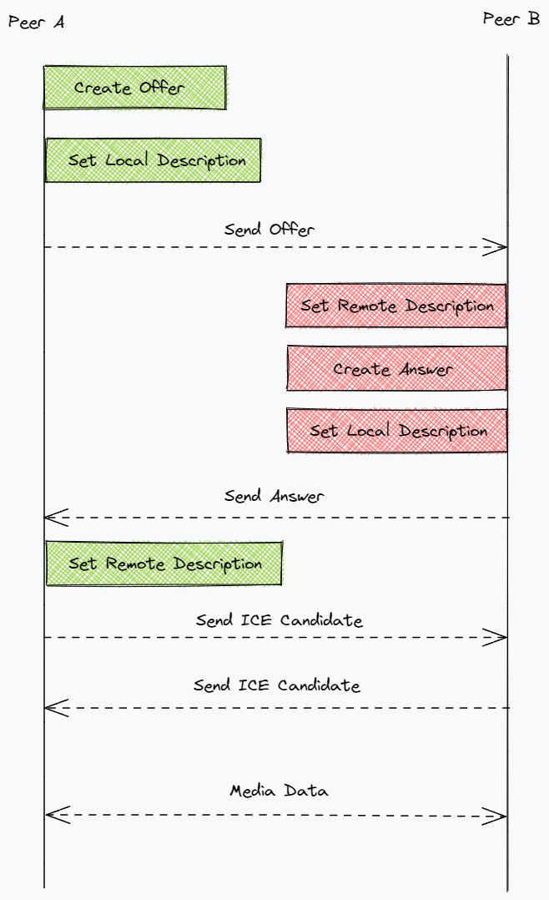

# Voom - WebRTC MESH | SFU | MCU

### What you gonna do

- WebSocket
- Socket.io
- Signaling using socket.io (Offer, Answer, ICE candidate)
- Transfer streaming video, audio and data
- Data channel
- Scaling Challenge ( 1:1, 1:N, M:N)
- Mediasoup for SFU
- CI (github actions + docker + nginx + certbot)

### What you need to understand

- ICE
- STUN
- NAT
- TURN
- SDP

---

### TODO

- [ ] JWT
- [ ] Mobile responsive
- [x] MyCamera Screen
- [x] Participants Screen
- [x] On / Off MyCamera
- [x] Mute / Unmute MyAudio
- [x] On / Off Peer Camera
- [x] Mute / Unmute Peer Audio
- [x] Fetch Public Rooms
- [x] Create / Join / Leave Room
- [x] Boradcast Enter / Leave Message on Chat
- [x] Signaling (Offer, Answer, ICE candidate, Link remote stream)
- [x] Chat by text through Data channel
- [ ] Chat with emoji
- [ ] Transfer images
- [ ] Transfer media
- [ ] List Participants
- [ ] List Viewers
- [x] 1:1 P2P
- [x] M:N P2P
- [ ] 1:N MCU
- [ ] 1:N SFU
- [x] SSL
